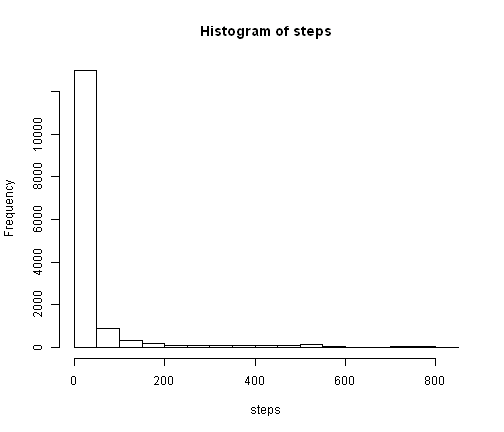
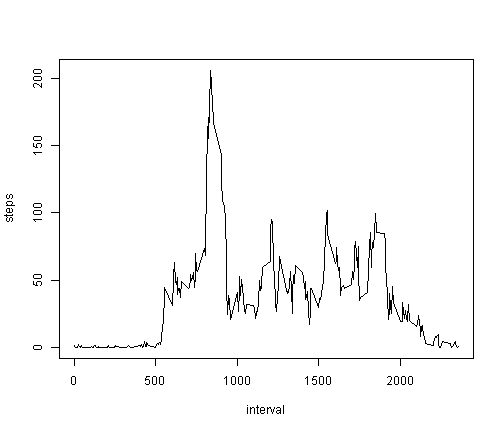
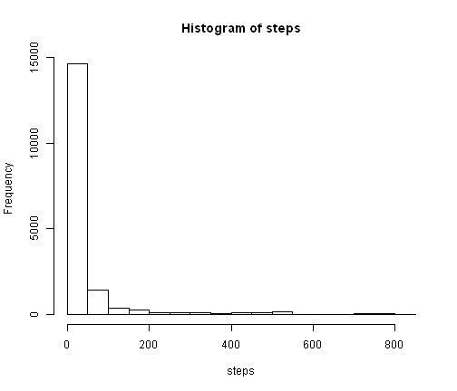
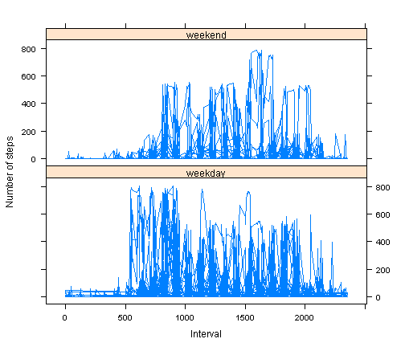

Reproducible Research Peer Assessment 1
========================================================

Load the data:

```r
dataActivity <- read.csv("activity.csv")
```


Get the lines with no NAs:

```r
cc <- complete.cases(dataActivity)
```


Create a copy of the dataset for removal of NAs:

```r
noNADataActivity <- dataActivity
```


Transform the dates:

```r
dataActivity$date <- as.POSIXlt(dataActivity$date)
```


What is mean total number of steps taken per day?:

```r
with(dataActivity, hist(steps))
```

 

Mean:

```r
mean(dataActivity$steps, na.rm = T)
```

```
## [1] 37.38
```

Median:

```r
median(dataActivity$steps, na.rm = T)
```

```
## [1] 0
```


What is the average daily activity pattern?

Get the average number of steps by interval

```r
dataActivityMean <- aggregate(dataActivity$steps, by = list(dataActivity$interval), 
    FUN = mean, na.rm = T)
names(dataActivityMean) <- c("interval", "steps")
```


Time series plot of the 5-minute interval (x-axis) and the average number of steps taken, averaged across all days (y-axis)

```r
with(dataActivityMean, plot(interval, steps, type = "l"))
```

 


Which 5-minute interval, on average across all the days in the dataset, contains the maximum number of steps?:

```r
maxSteps <- max(dataActivityMean$steps)
subset(dataActivityMean$interval, dataActivityMean$steps == maxSteps)
```

```
## [1] 835
```


Calculate and report the total number of missing values in the dataset (i.e. the total number of rows with NAs)

```r
sum(!cc)
```

```
## [1] 2304
```


Devise a strategy for filling in all of the missing values in the dataset.
Use the mean number of steps by interval

```r
for (i in 1:length(noNADataActivity[, 1])) {
    if (is.na(noNADataActivity[i, ]$steps)) {
        noNADataActivity[i, ]$steps <- subset(dataActivityMean$steps, dataActivityMean$interval == 
            noNADataActivity[i, ]$interval)
    }
}
```


What is mean total number of steps taken per day?:

```r
with(noNADataActivity, hist(steps))
```

 

Mean (same value, no impact for mean):

```r
mean(noNADataActivity$steps, na.rm = T)
```

```
## [1] 37.38
```

Median (same value, no impact for median):

```r
median(noNADataActivity$steps, na.rm = T)
```

```
## [1] 0
```


Create a new factor variable in the dataset with two levels – “weekday” and “weekend” indicating whether a given date is a weekday or weekend day.

```r
noNADataActivity$week <- "weekday"
noNADataActivity[weekdays(as.POSIXlt(noNADataActivity$date)) == "samedi", ]$week <- "weekend"
noNADataActivity[weekdays(as.POSIXlt(noNADataActivity$date)) == "dimanche", 
    ]$week <- "weekend"
noNADataActivity$week <- factor(noNADataActivity$week)
noNADataActivity$week <- relevel(noNADataActivity$week, "weekend")
```


Time series plot of the 5-minute interval (x-axis) and the average number of steps taken, averaged across all days (y-axis)

```r
library(lattice)
noNADataActivityMean <- aggregate(noNADataActivity$steps, by = list(noNADataActivity$interval, 
    noNADataActivity$week), FUN = mean, na.rm = T)
names(noNADataActivityMean) <- c("interval", "week", "steps")
xyplot(steps ~ interval | week, data = noNADataActivity, type = "l", as.table = T, 
    xlab = "Interval", ylab = "Number of steps", layout = (c(1, 2)))
```

 

